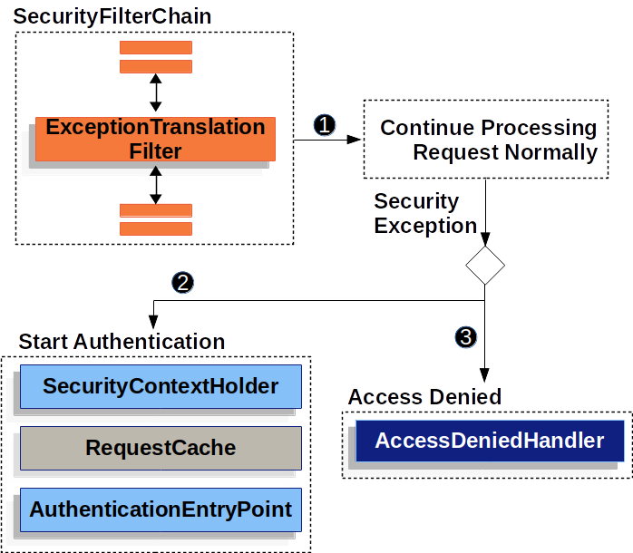

## Spring Security Architecture

Spring Security架构图：


### DelegatingFilterProxy

**DelegatingFilterProxy** 在 `Servlet容器` 和 `Spring ApplicationContext` 之间建立起桥梁。

可以按照Servlet容器提供的标准方式配置DelegatingFilterProxy，DelegatingFilterProxy会利用实现Filter接口的Bean实例完成工作。

```java
// DelegatingFilterProxy 伪代码
public void doFilter(ServletRequest request, ServletResponse response, FilterChain chain) {
	Filter delegate = getFilterBean(someBeanName); 
	delegate.doFilter(request, response); 
}
// Lazily get Filter that was registered as a Spring Bean. 
// Delegate work to the Spring Bean.
// 这里的Bean一定的懒加载的，因为tomcat中的Filter在Servlet容器启动前就要配置好，而这个时刻Spring Bean还没有被实例化。
```

DelegatingFilterProxy是**spring-web**包中的类，它是Spring MVC对Filter的支持，并不是与Spring Security强绑定的。

### FilterChainProxy

FilterChainProxy是spring-**security**-web包中的类，从它开始的类就都是Spring Security框架提供的类了。

FilterChainProxy可以代理多个SecutiryFilterChain：


上面两个图是FilterChainProxy中的源码，可以看到FilterChainProxy中包含多个SecutiryFilterChain，根据request找到匹配的SecutiryFilterChain，并执行对应SecutiryFilterChain中所有的Filter。

**FilterChainProxy是Spring Security的总入口！**

FilterChainProxy提供了灵活的request匹配方式。`FilterChainProxy` can determine invocation based upon anything in the `HttpServletRequest` by using the `RequestMatcher` interface.

### SecurityFilterChain

SecutiryFilterChain中封装了一系列需要真正执行的Filter实例：


The Security Filters are inserted into the FilterChainProxy with the SecurityFilterChain API. 

The filters are executed in a **specific order** to guarantee that they are invoked at the right time, for example, the `Filter` that performs authentication should be invoked before the `Filter` that performs authorization.

These security filters are most often declared using an HttpSecurity instance: 

```java
@Configuration
@EnableWebSecurity
public class SecurityConfig {
    @Bean
    public SecurityFilterChain filterChain(HttpSecurity httpSecurity) throws Exception {

        httpSecurity.csrf(Customizer.withDefaults())
                .httpBasic(Customizer.withDefaults())
                .formLogin(Customizer.withDefaults())
                .authorizeHttpRequests(authorize ->
                        authorize.anyRequest().authenticated()
                );

        return httpSecurity.build();
    }
}
```


## Handling Security Exceptions

ExceptionTranslationFilter也是一个Security Filter。

The **ExceptionTranslationFilter** allows translation of **AccessDeniedException** and **AuthenticationException** into HTTP responses.



```java
try {
	filterChain.doFilter(request, response);   // 1 
} catch (AccessDeniedException | AuthenticationException ex) {
	if (!authenticated || ex instanceof AuthenticationException) {
		startAuthentication();  // 2 If the user is not authenticated, Start Authentication.
	} else {
		accessDenied(); // 3
	}
}
```


